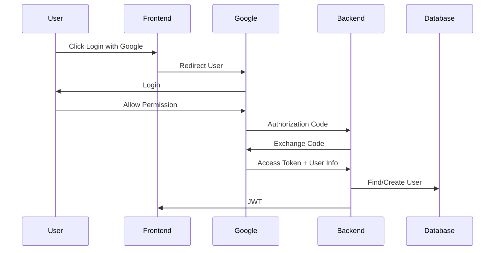
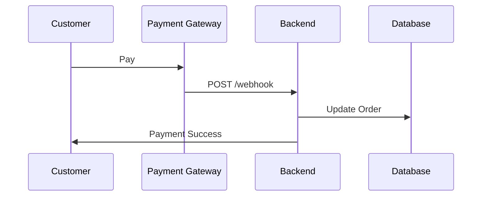
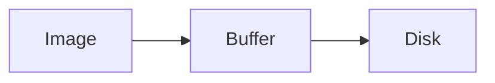
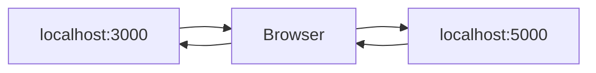
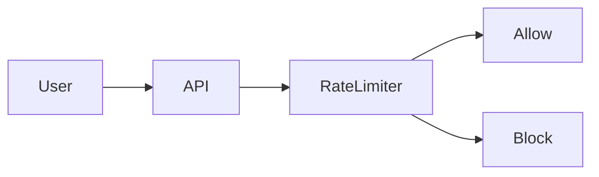

# 🚀 Backend Interview Notes (Node.js + Express)

**Date:** 27 June 2026

> These are the interview topics we covered today. Use this as your quick revision sheet before interviews.

---

# 1. Winston

## What is Winston?

**Definition**

Winston is a popular logging library for Node.js used to record application logs in a structured way.

Unlike `console.log()`, Winston supports:

* Multiple log levels
* Writing logs to files
* Logging to databases/cloud services
* Timestamped logs
* Error logs
* JSON formatted logs

---

## Why use Winston instead of console.log()?

| console.log()            | Winston                  |
| ------------------------ | ------------------------ |
| Simple logging           | Professional logging     |
| Terminal only            | File + Console           |
| No log levels            | info, warn, error, debug |
| No timestamps            | Timestamp support        |
| Hard to debug production | Easy debugging           |

---

## Example

```js
logger.info("User Logged In");

logger.error("Database Connection Failed");
```

---

## Interview Answer

> Winston is a logging library for Node.js that provides structured logging with multiple log levels, timestamps, and file support. It is commonly used in production applications for debugging and monitoring.

---

# 2. HTTP Methods

| Method | Purpose                 |
| ------ | ----------------------- |
| GET    | Fetch Data              |
| POST   | Create Data             |
| PUT    | Replace Entire Resource |
| PATCH  | Update Specific Fields  |
| DELETE | Delete Resource         |

---

## GET

```http
GET /users
```

Returns data.

---

## POST

```http
POST /users
```

Creates new data.

---

## PUT

Updates the **entire** resource.

Example

Before

```json
{
  "name":"Ritam",
  "age":21
}
```

PUT

```json
{
  "name":"Ritam"
}
```

Result

```json
{
  "name":"Ritam"
}
```

(age removed)

---

## PATCH

Updates only selected fields.

Before

```json
{
  "name":"Ritam",
  "age":21
}
```

PATCH

```json
{
  "age":22
}
```

Result

```json
{
  "name":"Ritam",
  "age":22
}
```

---

## DELETE

Deletes resource.

```http
DELETE /users/10
```

---

# 3. Can one HTTP request have multiple methods?

## Answer

❌ No.

One HTTP request can have only one HTTP method.

Example

```http
GET /users
```

OR

```http
POST /users
```

NOT

```http
GET + POST /users
```

---

## Why?

Because every HTTP request performs only one action.

---

## Interview Answer

> Every HTTP request has exactly one HTTP method because the method defines the action the client wants the server to perform. If multiple operations are required, they should be handled through multiple requests or internally by the server.

---

# 4. OAuth (Login with Google)

## What is OAuth?

OAuth is an authorization framework that allows users to grant limited access to their account without sharing their password.

---

## Login with Google Flow



---

## Steps

1. User clicks Login with Google.
2. Redirect to Google.
3. User logs in.
4. Google returns Authorization Code.
5. Backend exchanges code for tokens.
6. Backend gets user details.
7. Create/Login user.
8. Return JWT.

---

## Interview Answer

> OAuth allows users to log in without sharing their password with the application. After authentication, Google returns an authorization code, which the backend exchanges for tokens and retrieves the user's profile before logging them into the application.

---

# 5. API Versioning

## What is it?

Maintaining multiple API versions without breaking old clients.

---

## Why?

Suppose

Version 1

```http
/api/v1/users
```

returns

```json
{
    "name":"Ritam"
}
```

Later

Need

```json
{
    "fullName":"Ritam Maty"
}
```

Changing v1 breaks old apps.

Instead

```http
/api/v2/users
```

---

## Diagram

```mermaid
flowchart LR

OldApp --> V1[/api/v1/users]

NewApp --> V2[/api/v2/users]
```

---

## Interview Answer

> API Versioning allows us to introduce breaking changes while keeping existing clients working by maintaining multiple versions of the same API.

---

# 6. Webhooks

## What is a Webhook?

Webhook is an event-driven mechanism where one application automatically sends data to another application when an event occurs.

---

## API vs Webhook

| API             | Webhook       |
| --------------- | ------------- |
| Client requests | Server pushes |
| Request based   | Event based   |

---

## Payment Example



---

## Interview Answer

> A webhook automatically notifies another application when an event occurs, such as a successful payment or a Git push.

---

# 7. Buffers

## What is Buffer?

Temporary memory used to store binary data.

---

## Why?

Large files cannot be loaded into memory all at once.

Node processes them in chunks.

---

## Used In

* Images
* Videos
* Streams
* HTTP
* File Upload
* File Download

---

## Diagram



---

## String vs Buffer

| String         | Buffer      |
| -------------- | ----------- |
| Text           | Binary Data |
| Human Readable | Raw Bytes   |

---

## Interview Answer

> Buffer is a temporary memory allocation in Node.js used for storing binary data while reading or writing files and streams.

---

# 8. CORS

## What is CORS?

Cross-Origin Resource Sharing.

Browser security mechanism.

---

## Same Origin

Origin means

* Protocol
* Domain
* Port

All must be same.

---

## Diagram



---

## Fix

```js
app.use(cors({
    origin:"http://localhost:3000"
}))
```

---

## Why doesn't Postman show CORS?

Because

> CORS is enforced by browsers, not Postman.

---

## Interview Answer

> CORS is a browser security mechanism that controls cross-origin requests. The backend must explicitly allow trusted origins using CORS headers.

---

# 9. Same-Origin Policy

## Definition

Browser security rule.

Protocol + Domain + Port

must match.

Otherwise browser blocks access.

---

# 10. Rate Limiting

## What is it?

Restrict number of requests in a given time.

---

## Why?

Protect against

* DDoS
* Brute Force
* API Abuse
* Server Overload

---

## Diagram



---

## Express

```bash
npm install express-rate-limit
```

```js
const limiter = rateLimit({
    windowMs:15*60*1000,
    max:100
})

app.use(limiter)
```

---

## Interview Answer

> Rate Limiting restricts how many requests a client can make in a specific time period, protecting the application from abuse and excessive traffic.

---

# 11. Backend Performance Optimization

## Techniques

✅ Pagination

✅ Database Indexing

✅ Query Optimization

✅ Redis Cache

✅ Compression

✅ Promise.all()

✅ Background Jobs

✅ Connection Pooling

---

## Diagram

```mermaid
flowchart TD

Client

↓

API

↓

Redis Cache

Redis Cache -- Miss --> Database

Database --> Redis Cache

Redis Cache --> Response
```

---

## Example

Instead of

```sql
SELECT *
```

Use

```sql
SELECT username,email
```

---

Instead of

```js
await getUser()

await getPosts()

await getComments()
```

Use

```js
await Promise.all([
    getUser(),
    getPosts(),
    getComments()
])
```

---

## Interview Answer

> I would optimize the backend using pagination, indexing, query optimization, caching with Redis, Promise.all for parallel asynchronous operations, compression, background jobs, and connection pooling to improve performance and scalability.

---

# 12. Scenario Question

## Question

One API takes 3 seconds for 5 records.

Now database has 1000 records.

What will you do?

---

## Answer

1. Pagination
2. Database Indexing
3. Optimize Queries
4. Fetch Required Fields Only
5. Redis Cache
6. Compression
7. Promise.all()
8. Background Jobs
9. Connection Pooling

---

## Interview Answer

> First, I would identify the bottleneck. Then I would implement pagination, optimize database queries, create indexes, fetch only the required fields, use Redis for caching, parallelize independent operations using Promise.all, enable compression, move heavy tasks to background jobs, and use connection pooling to improve scalability and response time.

---

# ⭐ Interview Formula

Every answer should follow this structure:

1. Definition
2. Why?
3. Real-world Example
4. Conclusion

Example

Definition

↓

Why

↓

Example

↓

Interview Answer

---

# 🎯 Final Revision (Remember These)

* Winston → Logging
* GET → Read
* POST → Create
* PUT → Replace Entire Resource
* PATCH → Partial Update
* DELETE → Remove
* OAuth → Login with Google
* API Versioning → Keep old clients working
* Webhook → Event-based notification
* Buffer → Temporary memory for binary data
* CORS → Browser security
* SOP → Same Protocol + Domain + Port
* Rate Limiting → Protect server
* Pagination → Load limited data
* Indexing → Faster search
* Redis → Cache
* Promise.all → Parallel async tasks
* Compression → Smaller responses
* Background Jobs → Don't block requests

---

# 🚀 Interview Mindset

Always answer in this order:

* ✅ Definition
* ✅ Why is it needed?
* ✅ Real-world example
* ✅ Short conclusion

This structure makes your answers clear, professional, and easy for interviewers to follow.
