# Advanced MERN Backend Interview Preparation

## Q1: Explain Authentication vs Authorization

## ✅ Simple Answer

* Authentication = Checking who the user is
* Authorization = Checking what the user can access

---

## 🧠 Easy Understanding

### 🔹 Authentication

👉 User proves identity using:

* email/password
* OTP
* JWT token

Example:

* Login system

---

### 🔹 Authorization

👉 After login, server checks permissions.

Example:

* Admin dashboard access
* User role permissions

---

## 📊 Flow Diagram

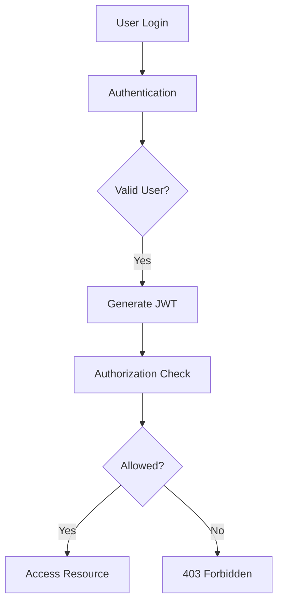

---

## 🧪 Example

```js
app.get('/admin', authMiddleware, adminMiddleware, (req, res) => {
  res.send('Admin Panel')
})
```

---

## 🎯 Interview Line

👉 “Authentication verifies user identity, while authorization checks what resources the authenticated user can access.”

---

# Q2: Explain JWT Structure and Working

## ✅ Simple Answer

JWT (JSON Web Token) is used for secure authentication between client and server.

---

## 🧠 JWT Structure

JWT has 3 parts:

```text
HEADER.PAYLOAD.SIGNATURE
```

---

## 📊 JWT Structure Diagram

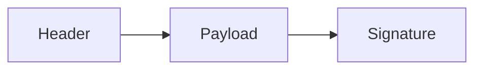

---

## 🔹 Header

Contains:

* algorithm
* token type

---

## 🔹 Payload

Contains user data:

```json
{
  "id": 101,
  "role": "admin"
}
```

---

## 🔹 Signature

Used to verify token security.

---

## 🧪 JWT Example

```js
const token = jwt.sign({ id: user._id }, SECRET, {
  expiresIn: '1d'
})
```

---

## 📊 JWT Flow

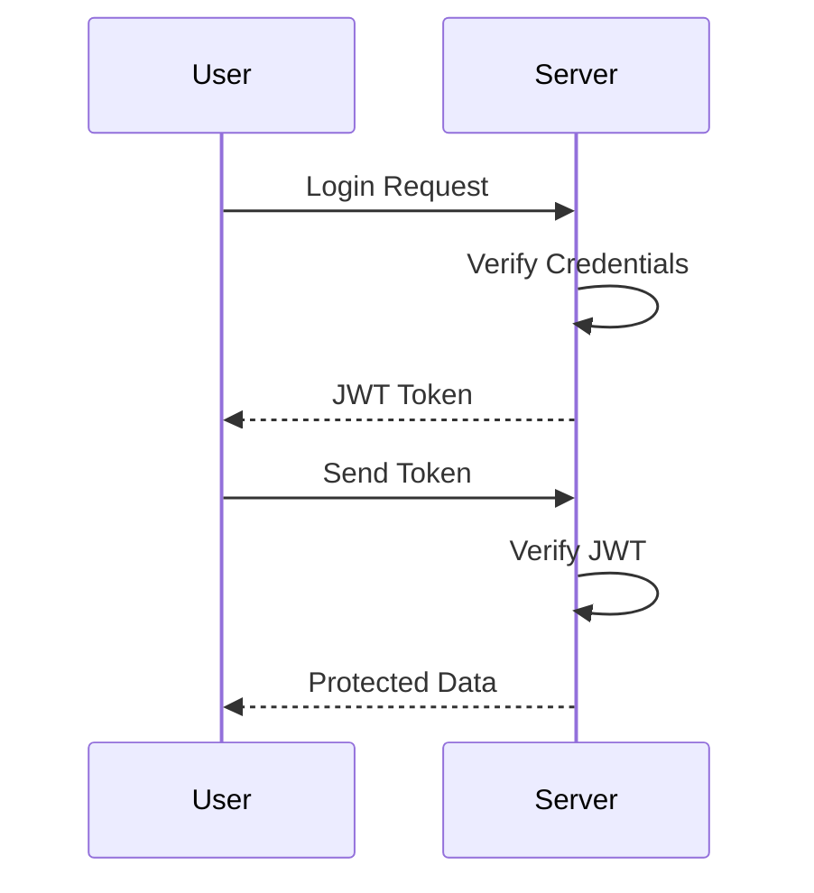

---

## 🎯 Interview Line

👉 “JWT is a stateless authentication mechanism where a signed token containing user information is generated and verified on every request.”

---

# Q3: Cookies vs LocalStorage vs SessionStorage

## ✅ Simple Answer

These are browser storage mechanisms.

---

## 📊 Comparison Table

| Feature        | Cookies              | LocalStorage      | SessionStorage    |
| -------------- | -------------------- | ----------------- | ----------------- |
| Expiry         | Configurable         | Permanent         | Browser tab close |
| Size           | Small                | Larger            | Larger            |
| Sent to Server | Yes                  | No                | No                |
| Security       | Better with HttpOnly | Vulnerable to XSS | Vulnerable to XSS |

---

## 📊 Storage Flow

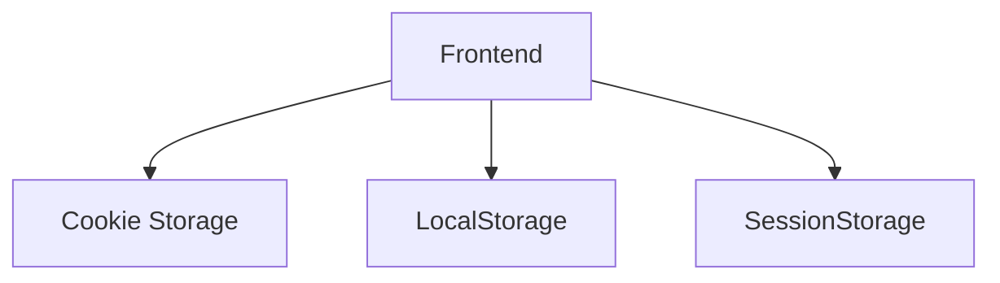

---

## 🚀 Best Practice

👉 Store JWT in HttpOnly cookies for better security.

---

# Q4: Explain bcrypt Password Hashing

## ✅ Simple Answer

bcrypt is used to securely hash passwords before storing them in the database.

---

## 🧠 Easy Understanding

👉 Plain password ❌
👉 Hashed password ✅

---

## 📊 Hashing Flow

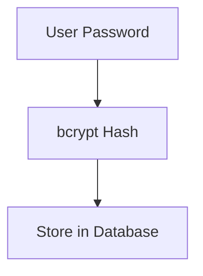

---

## 🧪 Example

```js
const bcrypt = require('bcrypt')

const hashed = await bcrypt.hash(password, 10)

const match = await bcrypt.compare(password, hashed)
```

---

## 🎯 Interview Line

👉 “bcrypt hashes passwords with salt to improve security and prevent password theft.”

---

# Q5: Explain MongoDB Indexing

## ✅ Simple Answer

Indexing improves database query performance.
🔥 Best Interview Version (Simple + Professional)

You can say:

Indexing in MongoDB improves query performance. Without indexing, MongoDB performs a full collection scan by checking documents one by one. But when we create an index, MongoDB stores indexed values with references to document locations using a data structure like a B-Tree. This allows MongoDB to quickly locate data instead of scanning the entire collection. For fields like email, we often use unique indexes to ensure duplicate values are not allowed.

---

## 🧠 Easy Understanding

Without index:
👉 MongoDB scans all documents ❌

With index:
👉 MongoDB finds data quickly ✅

---

## 📊 Indexing Flow

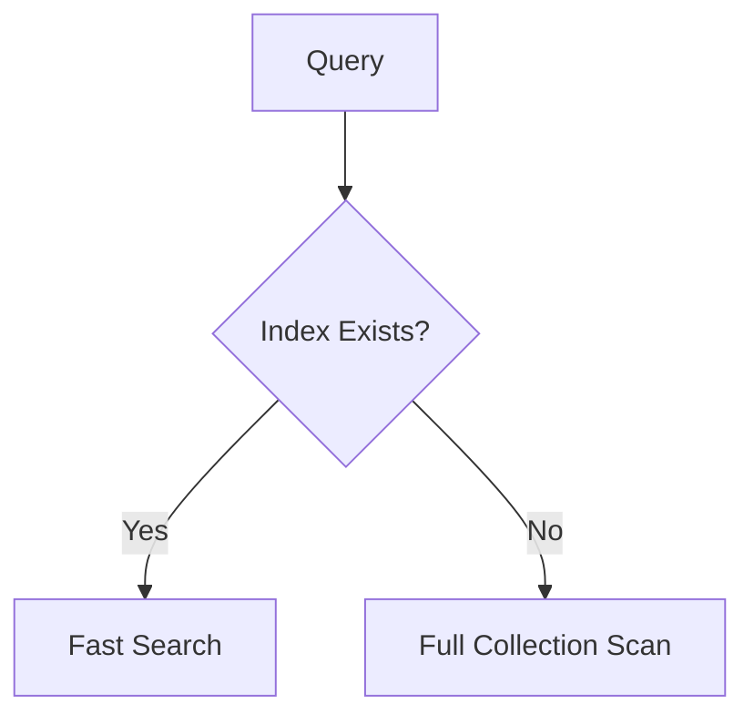

---

## 🧪 Example

```js
userSchema.index({ email: 1 })
```

---

## 🚀 Advantages

* Faster search
* Better sorting
* Improved scalability

---

## ⚠️ Disadvantage

Too many indexes increase write time and memory usage.

---

# Q6: Explain Aggregation Pipeline in MongoDB

## ✅ Simple Answer

Aggregation pipeline processes data step-by-step.

---

## 📊 Aggregation Flow

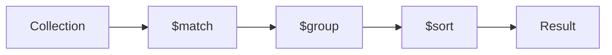

---

## 🧪 Example

```js
User.aggregate([
  { $match: { age: { $gt: 18 } } },
  { $group: { _id: '$country', total: { $sum: 1 } } }
])
```

---

## 🚀 Common Operators

* $match
* $group
* $sort
* $project
* $lookup

---

# Q7: Explain Pagination in APIs

## ✅ Simple Answer

Pagination divides large data into smaller pages.

---

## 📊 Pagination Flow

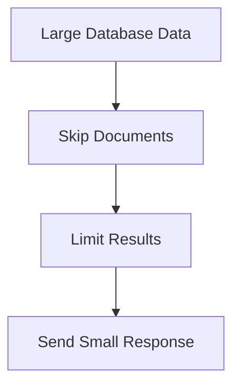

---

## 🧪 Example

```js
const page = 1
const limit = 10

const users = await User.find()
  .skip((page - 1) * limit)
  .limit(limit)
```

---

## 🚀 Advantages

* Faster APIs
* Lower memory usage
* Better frontend performance

---

# Q8: Explain Redis Caching

## ✅ Simple Answer

Redis stores frequently used data in memory for faster access.

---

## 📊 Redis Flow

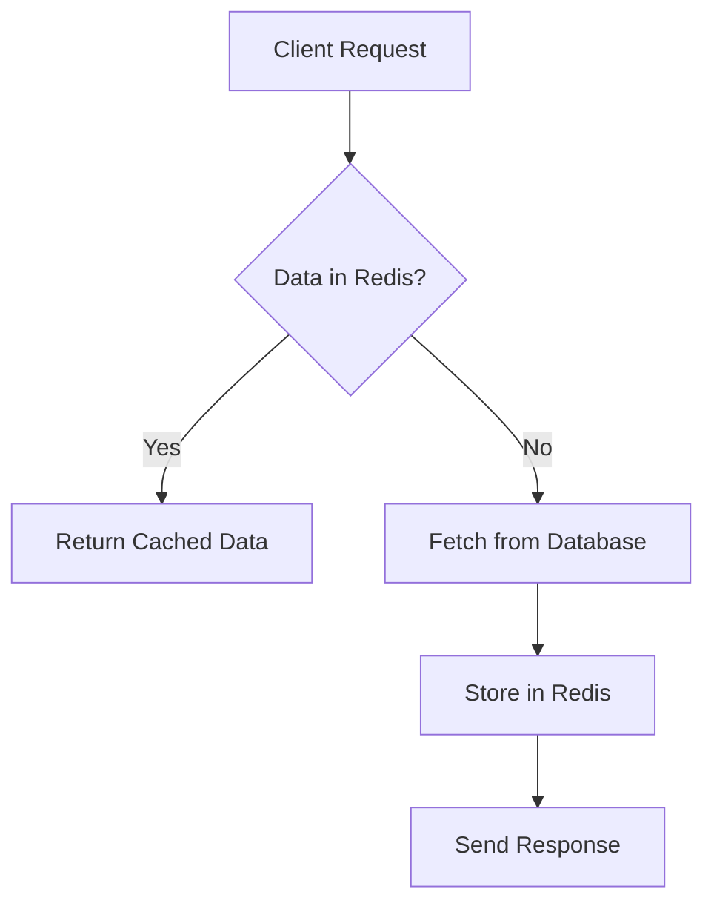

---

## 🧪 Example

```js
await redisClient.set('users', JSON.stringify(data))
```

---

## 🚀 Why Redis is Used

* Faster responses
* Reduces DB load
* Session storage
* Rate limiting

---

# Q9: Explain MVC Architecture in Express

## ✅ Simple Answer

MVC separates application logic into:

* Model
* View
* Controller

---

## 📊 MVC Diagram

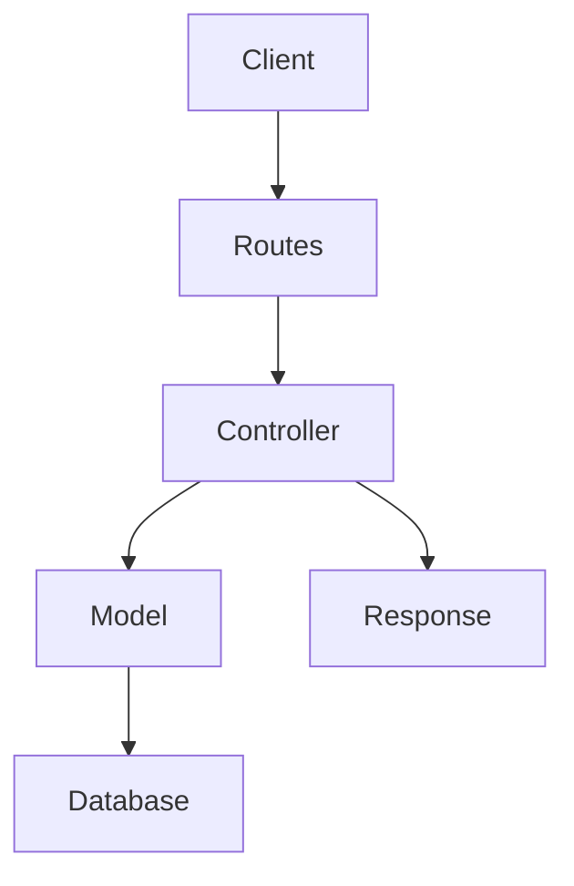

---

## 🧠 Folder Structure

```text
src/
 ├── models/
 ├── controllers/
 ├── routes/
 ├── middleware/
 └── services/
```

---

## 🚀 Advantages

* Clean architecture
* Better scalability
* Easy maintenance

---

# Q10: Explain API Gateway in Microservices

## ✅ Simple Answer

In a microservices architecture, an **API Gateway** is =a single entry point that sits between a client (like a mobile app or website) and the backend services

---

## 📊 API Gateway Flow

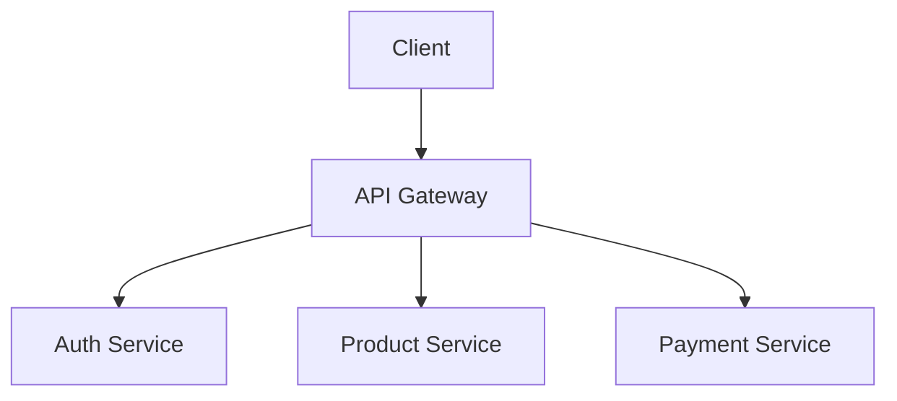

---

## 🚀 Responsibilities

* Authentication
* Routing
* Rate limiting
* Load balancing
* Logging

---

## 🎯 Interview Line

👉 “API Gateway acts as a centralized entry point in microservices architecture and manages routing, security, and request handling.”

---

# Q11: Explain WebSockets vs HTTP

## ✅ Simple Answer

HTTP is request-response based.
WebSocket enables real-time two-way communication.

---

## 📊 Comparison Diagram

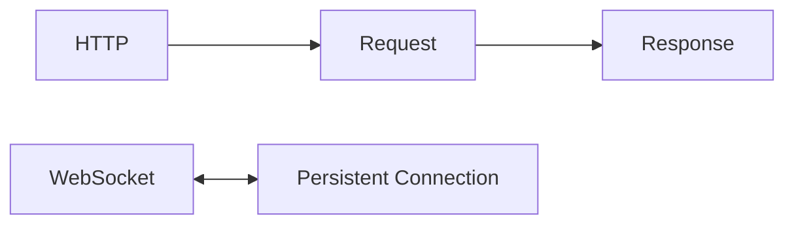

---

## 🚀 HTTP

* Connection closes after response
* Used for normal APIs

---

## 🚀 WebSocket

* Persistent connection
* Real-time communication
* Chat apps
* Notifications

---

# Q12: Explain PUT vs PATCH

## ✅ Simple Answer

* PUT = Replace entire resource
* PATCH = Update partial fields

---

## 🧪 Example

### PUT

```json
{
  "name": "Ritam",
  "age": 21
}
```

---

### PATCH

```json
{
  "age": 22
}
```

---

## 📊 Update Flow

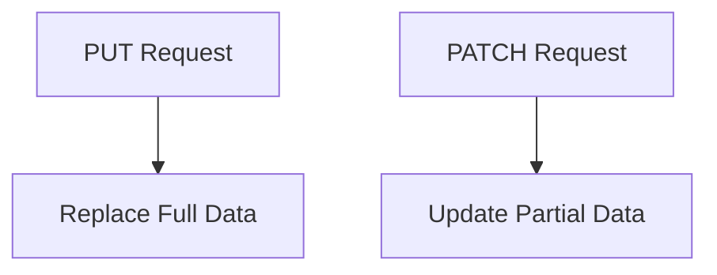

---

# Q13: Explain Full Backend CRUD Flow

## ✅ Simple Answer

CRUD Flow:
Frontend → API → Route → Controller → Database → Response

---

## 📊 Full Backend Flow

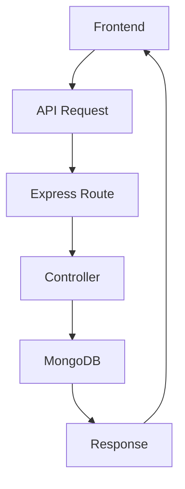

---

## 🚀 Important Concepts

* Validation
* Authentication
* Error handling
* Database queries

---

# Q14: Explain Rate Limiting

## ✅ Simple Answer

Rate limiting restricts too many requests from a user.

---

## 📊 Rate Limiting Flow

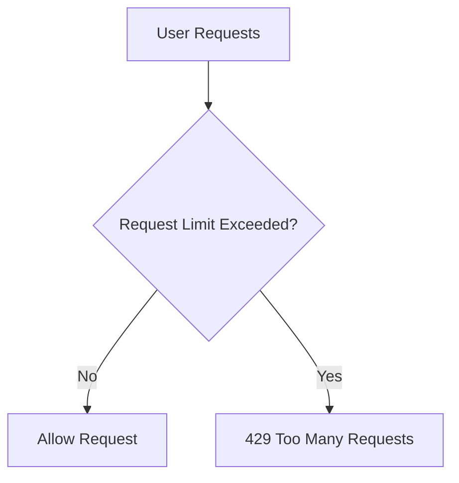

---

## 🧪 Example

```js
const rateLimit = require('express-rate-limit')

const limiter = rateLimit({
  windowMs: 15 * 60 * 1000,
  max: 100
})

app.use(limiter)
```

---

## 🚀 Why Important

* Prevent brute force attacks
* Prevent API abuse
* Protect servers

---

# Q15: Explain Database Relationships in MongoDB

## ✅ Simple Answer

MongoDB relationships are handled using:

* Embedding
* Referencing

---

## 📊 Relationship Diagram

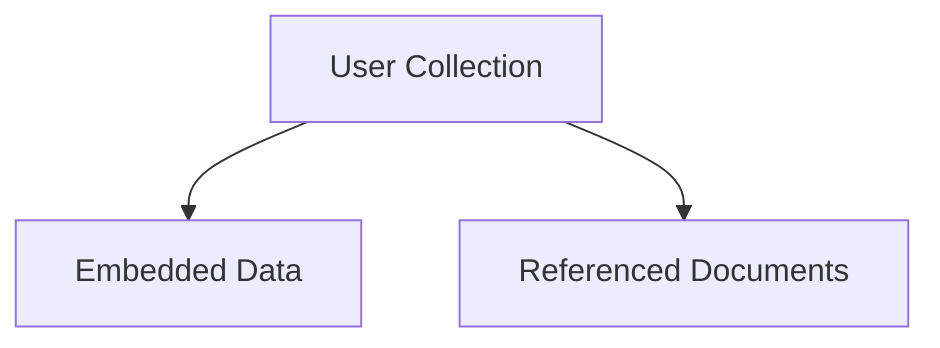

---

## 🔹 Embedding

Store related data together.

Good for:

* small related data

---

## 🔹 Referencing

Store relation using ObjectId.

Good for:

* large scalable systems

---

## 🧪 Example

```js
const postSchema = new mongoose.Schema({
  user: {
    type: mongoose.Schema.Types.ObjectId,
    ref: 'User'
  }
})
```

---

# Q16: Explain Docker in Backend Development 

## ✅ Simple Answer

Docker is a tool that helps us run applications inside containers. A container includes the application code, dependencies, libraries, and environment settings together.

In backend development, Docker is useful because backend projects often use many services like databases, Redis, and APIs. Docker helps run all of them in separate containers without installing everything manually on the system.

The main benefit of Docker is that the application works the same everywhere — on developer machines, testing servers, and production servers. It also makes deployment easier, avoids environment issues, and improves team collaboration.

For example, if a project works in Docker on my laptop, it will also work on another developer’s system or cloud server.

---

## 📊 Docker Flow

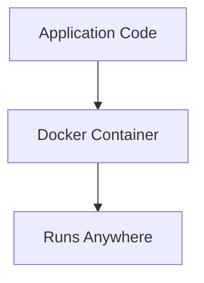

---

## 🚀 Advantages

* Same environment everywhere
* Easy deployment
* Lightweight containers
* Microservices support

---

## 🧪 Docker Commands

```bash
docker build -t myapp .
docker run -p 3000:3000 myapp
```

---

# Q17: Explain Kubernetes Basics

## ✅ Simple Answer

Kubernetes is a container orchestration tool used to manage Docker containers automatically. It helps deploy, scale, and manage applications running inside containers.

When an application grows, we may have many containers running on different servers. Managing them manually becomes difficult. Kubernetes helps automate this process.

For example, if one container crashes, Kubernetes automatically restarts it. If traffic increases, Kubernetes can create more containers to handle the load. It also helps with load balancing and smooth deployment updates.

In backend development, Kubernetes is mainly used in large-scale production systems where applications need high availability, scalability, and better management of multiple services.

In simple words, Docker creates and runs containers, while Kubernetes manages many containers in production.

## 📊 Kubernetes Architecture

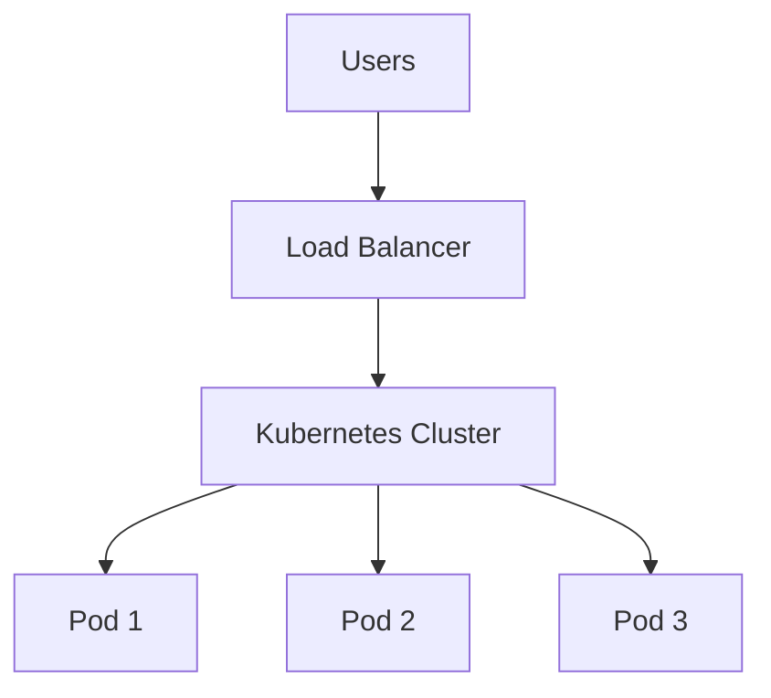

---

## 🚀 Responsibilities

* Scaling
* Load balancing
* Auto healing
* Container orchestration

---

# Q18: Explain Message Queues (RabbitMQ/Kafka)

## ✅ Simple Answer

Message queues help services communicate asynchronously.

---

## 📊 Queue Flow

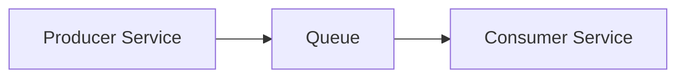

---

## 🚀 Why Used

* Async communication
* Better scalability
* Decoupled systems

---

# Q19: Explain Access Token vs Refresh Token

## ✅ Simple Answer

* Access Token = short-lived token
* Refresh Token = generates new access token

---

## 📊 Token Flow

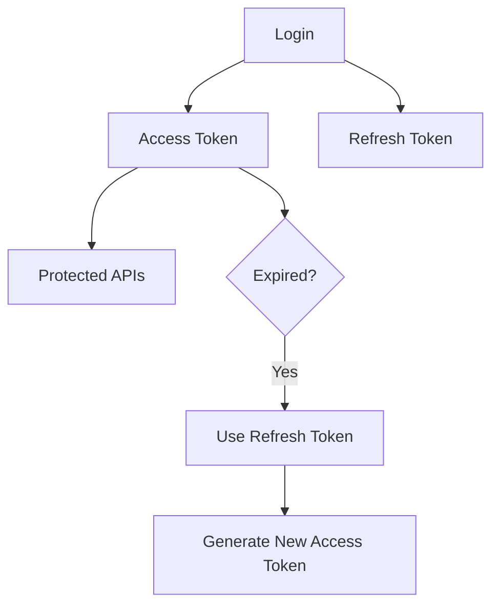

---

## 🚀 Why Important

* Better security
* Long user sessions
* Reduced login frequency

---

# Q20: Explain Async Error Handling in Express

## ✅ Simple Answer

Async errors should be handled using try-catch or centralized middleware.

---

## 📊 Error Handling Flow

```mermaid
flowchart TD
    A["Async Route"] --> B["Error Occurs"]
    B --> C["next(error)"]
    C --> D["Central Error Middleware"]
    D --> E["Send Error Response"]
```

---

## 🧪 Example

```js
app.get('/users', async (req, res, next) => {
  try {
    const users = await User.find()
    res.json(users)
  } catch (err) {
    next(err)
  }
})
```

---

## 🎯 Interview Line

👉 “Centralized async error handling improves scalability, readability, and consistent API responses.”
