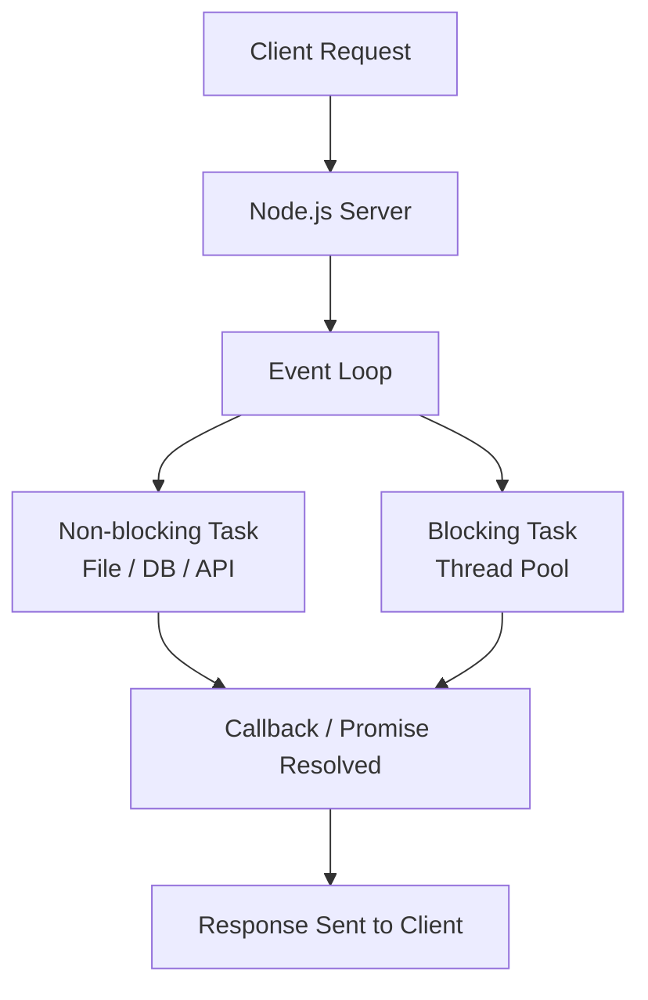
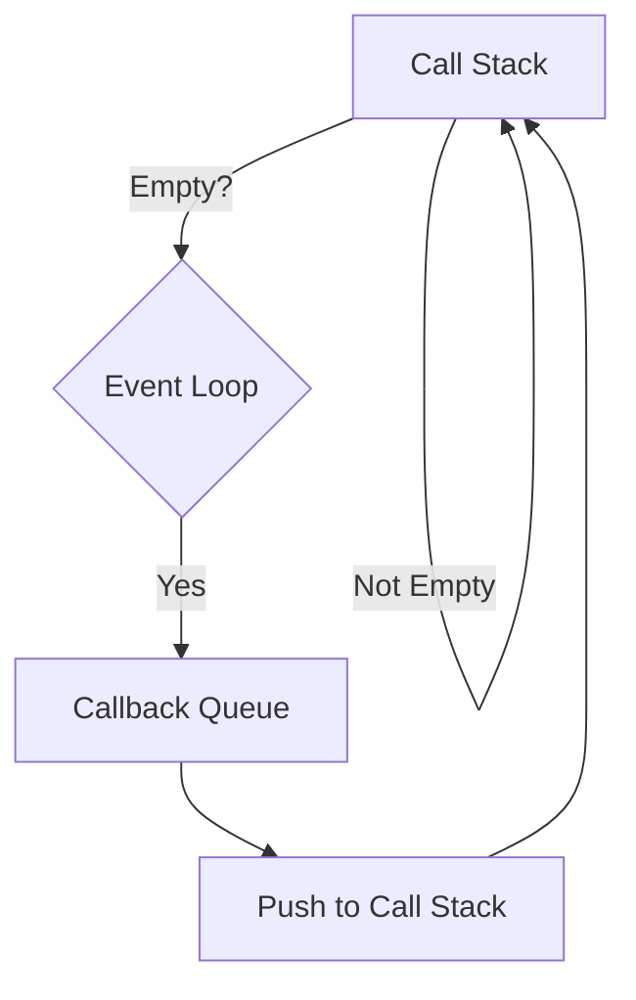
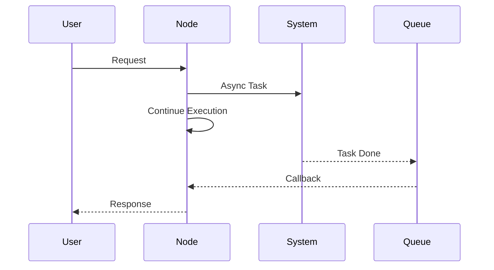
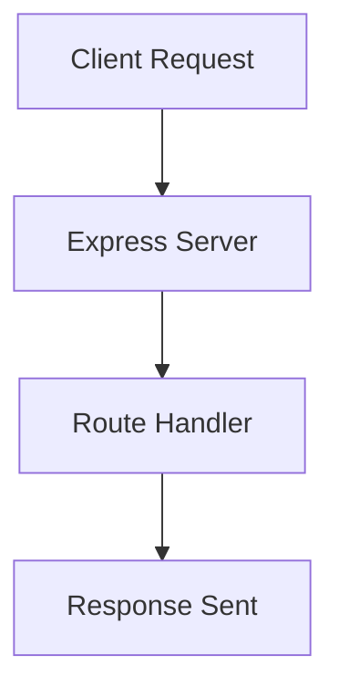
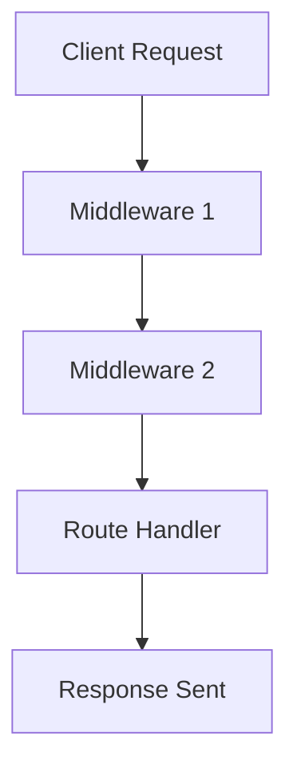
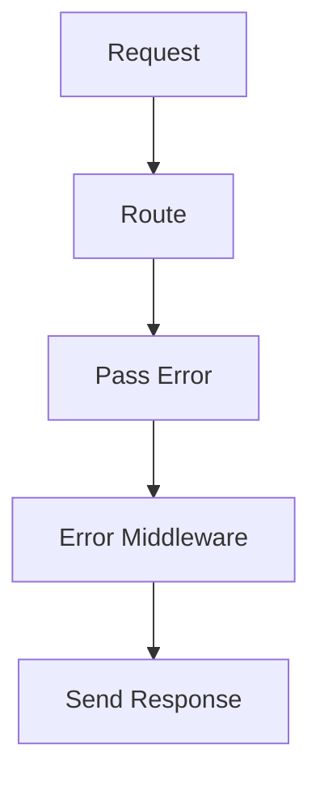
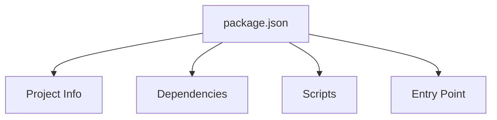
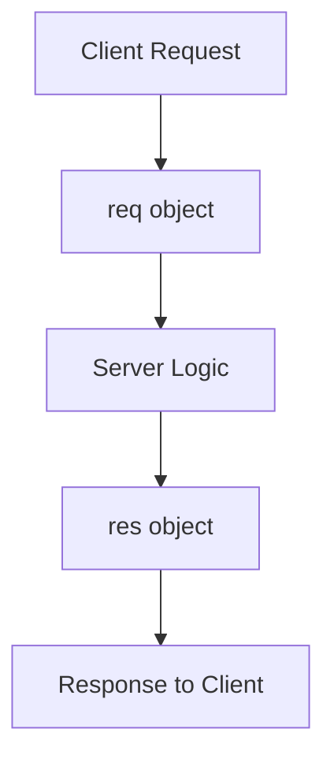
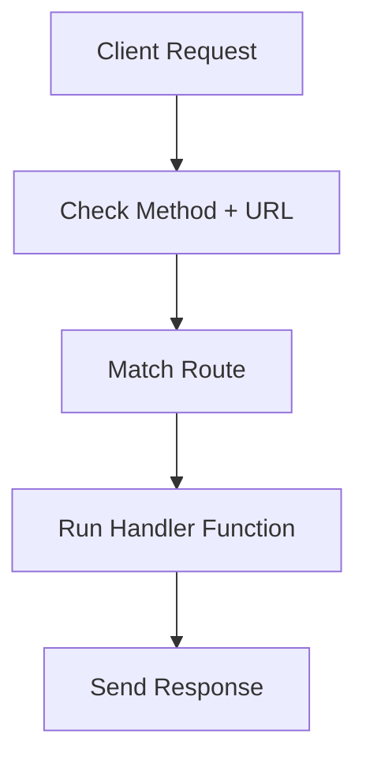

# Q1: What is Node.js, and how does it handle asynchronous operations?

## ✅ Simple Answer

Node.js is a **JavaScript runtime environment** that allows JavaScript to run outside the browser (mainly on the server side).

It is built on **Chrome’s V8 engine** and is widely used for building fast, scalable backend applications.

---

## ⚙️ How Node.js handles Asynchronous Operations

Node.js uses an **event-driven, non-blocking I/O model**.

👉 This means Node.js does NOT wait for tasks like file reading, database calls, or API requests.
👉 Instead, it continues executing other code and handles the result later.

It uses:

- Callbacks
- Promises
- async/await

---

## 📊 Architecture Diagram (Event Loop Flow)



---

# Q2: Explain the Event Loop in Node.js and its significance in managing concurrency

## ✅ Simple Answer

The **Event Loop** is the core part of Node.js that allows it to handle multiple tasks using a **single thread**.

It continuously checks if the main thread is free and executes pending tasks from the queue.

## ⚙️ How Event Loop Works

👉 Node.js executes code in a **Call Stack**
👉 Async tasks (File, DB, API) are sent to the system
👉 Once completed, results go to the **Callback Queue**
👉 Event Loop pushes them back to the Call Stack when it’s empty

---

## 📊 Event Loop Diagram



---

## 🔄 Real Execution Flow



---

## 🚀 Why It’s Important (Concurrency)

* Handles **many requests at the same time**
* No need for multiple threads
* Prevents blocking execution
* Improves performance and scalability

---

## 🎯 Key Point

👉 Event Loop makes Node.js **non-blocking & highly scalable**
👉 That’s why Node.js can handle thousands of users efficiently

# Q3: Describe how to set up a basic Express.js server. What are the primary components of an Express app?

## ✅ Simple Answer

An **Express.js server** is a minimal backend server built using the Express framework on top of Node.js.

It handles requests, responses, and routing in a simple and organized way.

---

## ⚙️ Steps to Set Up a Basic Express Server

### 1️⃣ Install Express

```bash
npm init -y
npm install express
```

### 2️⃣ Create Server File (index.js)

```js
const express = require('express')
const app = express()

// Route
app.get('/', (req, res) => {
  res.send('Hello World')
})

// Start server
app.listen(3000, () => {
  console.log('Server running on port 3000')
})
```

### 3️⃣ Run Server

```bash
node index.js
```

---

## 📊 Express Server Flow



---

## 🧩 Primary Components of Express App

* **app** → Main application instance
* **Routes** → Define endpoints (GET, POST, etc.)
* **Middleware** → Functions that run before response (auth, logging, parsing)
* **Request (req)** → Incoming data from client
* **Response (res)** → Data sent back to client

---

## 🚀 Key Points

* Express simplifies backend development
* Easy routing and middleware support
* Lightweight and fast
* Widely used in REST APIs

---

## 🎯 Key Point

👉 Express = Simple way to build powerful backend servers in Node.js

# Q4: What is middleware in Express, and how do you use it to handle requests and responses?

## ✅ Simple Answer

**Middleware** in Express is a function that runs **between the request and the response**.

It can **modify the request/response**, execute logic, or pass control to the next function.

---

## ⚙️ How Middleware Works

👉 Client sends request
👉 Middleware processes it (auth, logging, parsing, etc.)
👉 Then passes control using `next()`
👉 Finally, response is sent

---

## 📊 Middleware Flow



---

## 🧪 Example Code

```js
const express = require('express')
const app = express()

// Middleware
app.use((req, res, next) => {
  console.log('Request received')
  next() // pass control
})

// Route
app.get('/', (req, res) => {
  res.send('Hello from server')
})

app.listen(3000)
```

---

## 🧩 Types of Middleware

* **Application-level** → `app.use()`
* **Router-level** → `router.use()`
* **Built-in** → `express.json()`
* **Third-party** → e.g., morgan, cors
* **Error-handling** → `(err, req, res, next)`

---

## 🚀 Why Middleware is Important

* Reuse common logic
* Handle authentication & validation
* Logging & debugging
* Control request flow

---

## 🎯 Key Point

👉 Middleware = **Power of Express** to control and process requests step-by-step

# Q6: How would you implement error handling in an Express application?

## ✅ Simple Answer

Error handling in Express is done using **middleware**.

👉 We create a special middleware with 4 parameters:
`(err, req, res, next)`

---

## 🧠 Simple Thinking

👉 If error happens → pass it using `next(err)`
👉 Error middleware catches it
👉 Send proper response

---

## 🧪 Code Example (Easy to Remember)

```js
const express = require('express')
const app = express()

// Route with error
app.get('/', (req, res, next) => {
  const error = new Error("Something went wrong")
  next(error) // pass error
})

// Error handling middleware
app.use((err, req, res, next) => {
  console.log(err.message)

  res.status(500).json({
    success: false,
    message: err.message
  })
})

app.listen(3000)
```

---

## 📊 Flow



---

## 🚀 Key Points

* Always use `next(err)` to pass error
* Error middleware must have **4 parameters**
* Place it **after routes**
* Used for centralized error handling

---

## 🎯 Interview Line (IMPORTANT)

👉 “In Express, error handling is done using middleware with four parameters. Errors are passed using next(err) and handled in a centralized error-handling middleware.”

# Q7: Discuss the role of the package.json file in a Node.js project. What information can you find in it?

## ✅ Simple Answer

`package.json` is the **main configuration file** of a Node.js project.

👉 It stores **project details, dependencies, and scripts** needed to run the application.

---

## 🧠 Simple Thinking

👉 It tells:
- What this project is  
- What it depends on  
- How to run it  

---

## 🧪 Example package.json

```json
{
  "name": "my-app",
  "version": "1.0.0",
  "description": "Sample Node.js app",
  "main": "index.js",
  "scripts": {
    "start": "node index.js"
  },
  "dependencies": {
    "express": "^4.18.2"
  }
}
````

---

## 📊 Structure Flow



---

## 🧩 Important Fields

* **name** → project name
* **version** → app version
* **main** → entry file (index.js)
* **scripts** → commands (start, dev)
* **dependencies** → required packages
* **devDependencies** → only for development
* **description** → project info

---

## 🚀 Why It’s Important

* Manages all dependencies
* Helps install packages using `npm install`
* Defines how to run the app
* Makes project portable

---

## 🎯 Interview Line

👉 “package.json is the core file of a Node.js project that contains metadata, dependencies, and scripts required to manage and run the application.”

---


# Q8: How do you manage dependencies in a Node.js application? Explain the difference between installation types
Got you 👍 — I’ll explain this in **very simple words (no heavy definitions)**

---

## 🧠 What is Dependency? (Super Simple)

👉 Dependency = **a package you use in your project**

Example:

* You use **express** → it is a dependency
* You use **nodemon** → it is also a dependency

---

## ⚙️ How you manage it (Simple)

👉 You install using npm:

```bash
npm install express
```

👉 It automatically:

* Adds it in `package.json`
* Downloads it in `node_modules`

---

## 🔥 Types (Real Meaning)

### 1️⃣ dependencies (Important for app)

👉 These are needed to **run your app**

Example:

```bash
npm install express
```

👉 Without this → your server won’t run ❌

---

### 2️⃣ devDependencies (Only for development)

👉 These are used while **coding**, not in real app

Example:

```bash
npm install nodemon --save-dev
```

👉 nodemon just helps you restart server
👉 Not needed in production

---

### 3️⃣ Global (System level)

```bash
npm install -g nodemon
```

👉 Works anywhere in your system
👉 Not saved in project

---

## 💡 Easy Example (Best)

Think like:

* **dependencies** → Engine of car 🚗 (must have)
* **devDependencies** → Tools to build car 🔧 (not needed to drive)

---

## 🎯 Simple Interview Line

👉 “Dependencies are packages used in a project. Important ones go in dependencies, and development tools go in devDependencies.”

---

If you want, I can now:
✔ Convert this simple explanation into your **MD format**
✔ Or simplify all previous answers like this for revision 🔥

# Q9: What is the purpose of req and res objects in Express, and how can you use them to read client data?

## ✅ Simple Answer

- **req (request)** → contains data sent by the client  
- **res (response)** → used to send data back to the client  

---

## 🧠 Simple Thinking

👉 Client sends data → comes in **req**  
👉 Server sends reply → using **res**  

---

## 🧪 Example Code

```js
const express = require('express')
const app = express()

app.use(express.json()) // to read JSON body

app.post('/user', (req, res) => {
  const name = req.body.name   // read data from client

  res.send(`Hello ${name}`)    // send response
})

app.listen(3000)
````

---

## 📊 Flow



---

## 🧩 Where data comes from (req)

* `req.body` → data from POST request
* `req.params` → URL params (`/user/:id`)
* `req.query` → query string (`?name=ritam`)

---

## 🚀 Key Points

* req = input
* res = output
* Used in every route
* Core part of Express

---

## 🎯 Interview Line

👉 “req object is used to read data from the client, and res object is used to send response back to the client in Express.”

<!-- ! not done yet -->

# Q10: Explain how routing works in Express. How do you define routes and parameters?

## ✅ Simple Answer

**Routing** in Express means defining how the server responds to different **URLs (endpoints)** and **HTTP methods (GET, POST, etc.)**.

👉 Each route has a **path + method + handler function**

---

## 🧠 Simple Thinking

👉 User hits URL → Express checks route → runs matching function → sends response  

---

## 🧪 Basic Route Example

```js
const express = require('express')
const app = express()

// GET route
app.get('/', (req, res) => {
  res.send('Home Page')
})

// POST route
app.post('/user', (req, res) => {
  res.send('User Created')
})

app.listen(3000)
````

---

## 🔑 Route Parameters (Dynamic Values)

```js
app.get('/user/:id', (req, res) => {
  const userId = req.params.id
  res.send(`User ID is ${userId}`)
})
```

👉 `/user/101` → id = 101

---

## 🔍 Query Parameters

```js
app.get('/search', (req, res) => {
  const name = req.query.name
  res.send(`Searching for ${name}`)
})
```

👉 `/search?name=ritam`

---

## 📊 Routing Flow



---

## 🧩 Key Parts of a Route

* **Method** → GET, POST, PUT, DELETE
* **Path** → `/user`, `/product/:id`
* **Handler** → `(req, res) => {}`

---

## 🚀 Key Points

* Routing decides how server responds
* Supports dynamic params and query
* Core feature of Express

---

## 🎯 Interview Line

👉 “Routing in Express is used to define how the server responds to different URLs and HTTP methods. It supports dynamic parameters using req.params and query data using req.query.”

