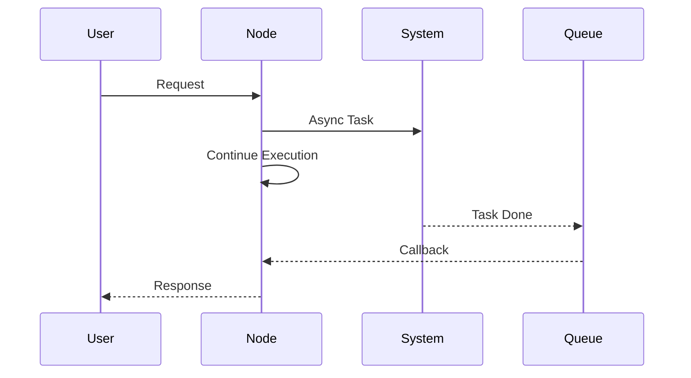
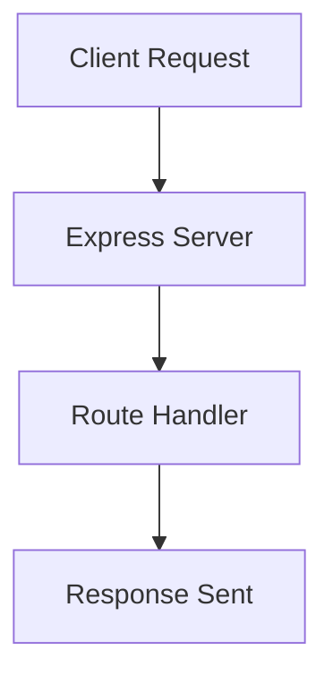

# Q1: What is Node.js, and how does it handle asynchronous operations?

## ✅ Simple Answer

Node.js is a **JavaScript runtime environment** that allows JavaScript to run outside the browser (mainly on the server side).

It is built on **Chrome’s V8 engine** and is widely used for building fast, scalable backend applications.

---

## ⚙️ How Node.js handles Asynchronous Operations

Node.js uses an **event-driven, non-blocking I/O model**.

👉 This means Node.js does NOT wait for tasks like file reading, database calls, or API requests.  
👉 Instead, it continues executing other code and handles the result later.

It uses:
- Callbacks
- Promises
- async/await

---

## 📊 Architecture Diagram (Event Loop Flow)

```mermaid
flowchart TD
    A[Client Request] --> B[Node.js Server]
    B --> C[Event Loop]

    C --> D[Non-blocking Task<br/>File / DB / API]
    C --> E[Blocking Task<br/>Thread Pool]

    D --> F[Callback / Promise Resolved]
    E --> F

    F --> G[Response Sent to Client]
````

---

# Q2: Explain the Event Loop in Node.js and its significance in managing concurrency

## ✅ Simple Answer

The **Event Loop** is the core part of Node.js that allows it to handle multiple tasks using a **single thread**.

It continuously checks if the main thread is free and executes pending tasks from the queue.


## ⚙️ How Event Loop Works

👉 Node.js executes code in a **Call Stack**
👉 Async tasks (File, DB, API) are sent to the system
👉 Once completed, results go to the **Callback Queue**
👉 Event Loop pushes them back to the Call Stack when it’s empty

---

## 📊 Event Loop Diagram

```mermaid
flowchart TD
    A[Call Stack] -->|Empty?| B{Event Loop}
    B -->|Yes| C[Callback Queue]
    C --> D[Push to Call Stack]
    D --> A

    A -->|Not Empty| A
```

---

## 🔄 Real Execution Flow



---

## 🚀 Why It’s Important (Concurrency)

* Handles **many requests at the same time**
* No need for multiple threads
* Prevents blocking execution
* Improves performance and scalability

---

## 🎯 Key Point

👉 Event Loop makes Node.js **non-blocking & highly scalable**
👉 That’s why Node.js can handle thousands of users efficiently

# Q3: Describe how to set up a basic Express.js server. What are the primary components of an Express app?

## ✅ Simple Answer

An **Express.js server** is a minimal backend server built using the Express framework on top of Node.js.

It handles requests, responses, and routing in a simple and organized way.

---

## ⚙️ Steps to Set Up a Basic Express Server

### 1️⃣ Install Express
```bash
npm init -y
npm install express
````

### 2️⃣ Create Server File (index.js)

```js
const express = require('express')
const app = express()

// Route
app.get('/', (req, res) => {
  res.send('Hello World')
})

// Start server
app.listen(3000, () => {
  console.log('Server running on port 3000')
})
```

### 3️⃣ Run Server

```bash
node index.js
```

---

## 📊 Express Server Flow



---

## 🧩 Primary Components of Express App

* **app** → Main application instance
* **Routes** → Define endpoints (GET, POST, etc.)
* **Middleware** → Functions that run before response (auth, logging, parsing)
* **Request (req)** → Incoming data from client
* **Response (res)** → Data sent back to client

---

## 🚀 Key Points

* Express simplifies backend development
* Easy routing and middleware support
* Lightweight and fast
* Widely used in REST APIs

---

## 🎯 Key Point

👉 Express = Simple way to build powerful backend servers in Node.js

---

```
```

