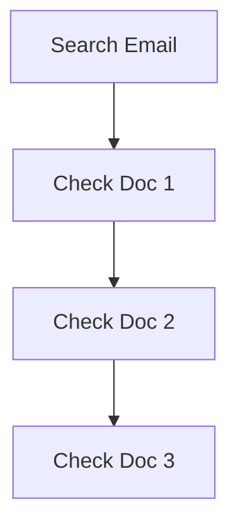
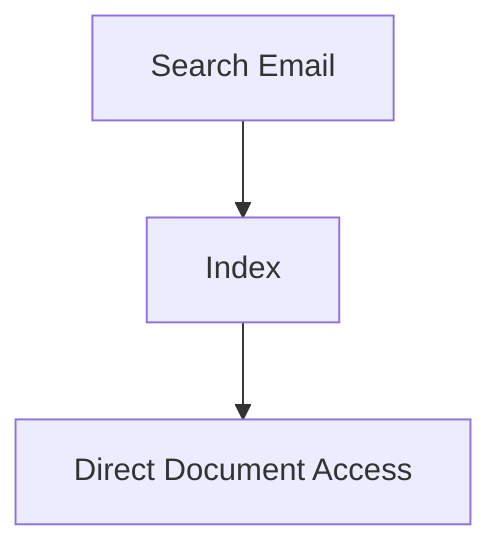
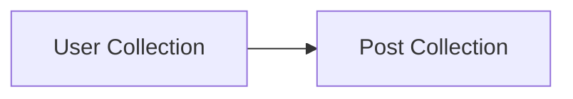
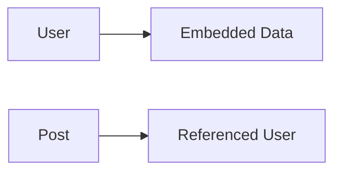
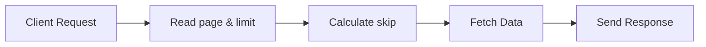
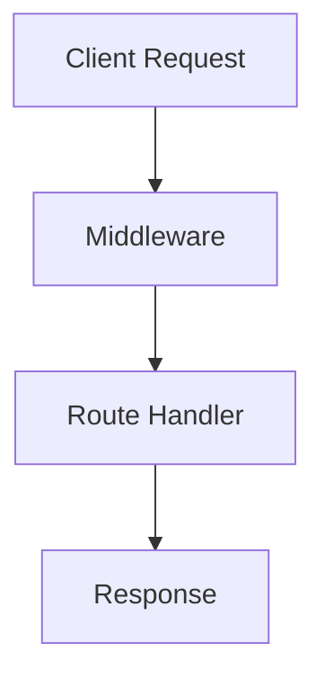
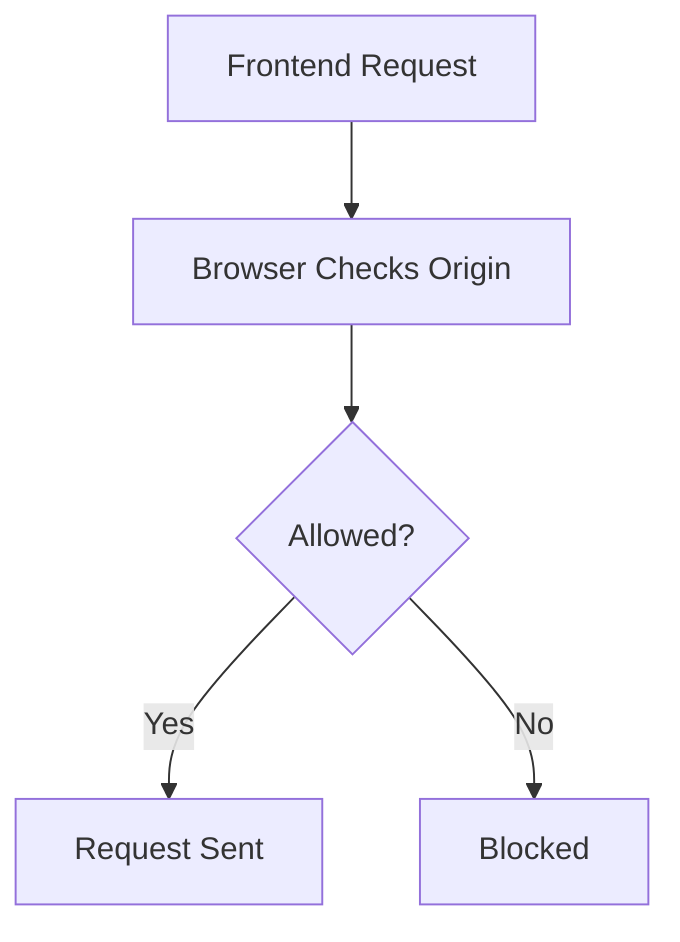
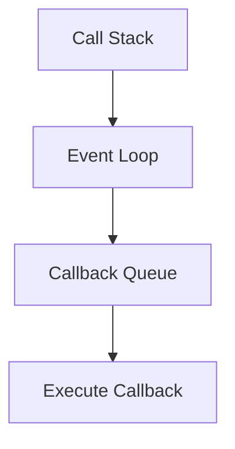
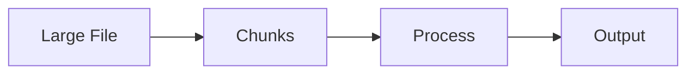
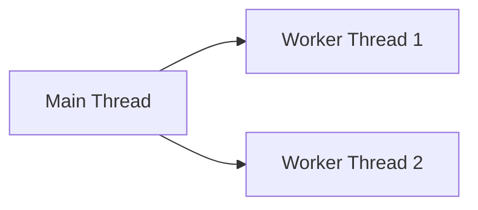

# MERN Backend Interview Preparation Notes

Prepared for: Ritam

---

# MongoDB Interview Questions

---

# 1. Explain the Aggregation Pipeline and Its Stages

## Simple Explanation

Aggregation is used to process data inside MongoDB.

It helps to:

* filter data
* group data
* calculate totals
* create reports
* sort data

You can think of aggregation like:

```text
Data -> Process -> Final Result
```

---

# Aggregation Pipeline Flow


---

# Important Stages

| Stage    | Purpose          |
| -------- | ---------------- |
| $match   | filter documents |
| $group   | group documents  |
| $sort    | sort data        |
| $project | select fields    |
| $limit   | limit results    |
| $lookup  | join collections |

---

# Example

```js
db.users.aggregate([
  {
    $match: {
      age: { $gt: 18 }
    }
  },
  {
    $group: {
      _id: "$country",
      totalUsers: { $sum: 1 }
    }
  }
])
```

---

# What Happens Internally

## Step 1

MongoDB filters users age > 18.

## Step 2

Groups users by country.

## Step 3

Counts users.

---

# Interview Ready Answer

Aggregation pipeline in MongoDB is used to process and analyze data through multiple stages like filtering, grouping, sorting, and transforming documents. It is mainly used for analytics, reports, and optimized backend queries.

---

# 2. How Does Indexing Work in MongoDB?

## Simple Explanation

Indexing makes searching faster.

Without indexing:

MongoDB checks documents one by one.

With indexing:

MongoDB directly finds data using the index.

---

# Without Index



---

# With Index



---

# Example

```js
db.users.createIndex({ email: 1 })
```

---

# Compound Index

Used for multiple fields.

```js
db.users.createIndex({ country: 1, age: -1 })
```

---

# Why Indexing is Important

* faster searching
* better performance
* faster sorting
* uniqueness support

---

# Interview Ready Answer

Indexing in MongoDB improves query performance by creating a data structure that allows MongoDB to find documents quickly without scanning the entire collection. Compound indexes are indexes created on multiple fields.

---

# 3. Difference Between find(), findOne(), and aggregate()

| Method      | Purpose                     |
| ----------- | --------------------------- |
| find()      | returns multiple documents  |
| findOne()   | returns single document     |
| aggregate() | processes and analyzes data |

---

# Example

## find()

```js
User.find()
```

Returns all users.

---

## findOne()

```js
User.findOne({ email: "test@gmail.com" })
```

Returns one user.

---

## aggregate()

```js
User.aggregate([
  {
    $group: {
      _id: "$country",
      total: { $sum: 1 }
    }
  }
])
```

---

# Interview Ready Answer

find() is used to fetch multiple documents, findOne() returns a single document, and aggregate() is used for advanced data processing like grouping, filtering, calculations, and analytics.

---

# 4. What is Schema Design?

## Simple Explanation

Schema design means deciding:

* how data will be stored
* how collections are related
* embedding vs referencing

Good schema design improves:

* performance
* scalability
* maintainability

---

# Relationship Types

| Type | Example             |
| ---- | ------------------- |
| 1:1  | user -> profile     |
| 1:N  | user -> posts       |
| N:N  | students -> courses |

---

# Embedded Document

```json
{
  "name": "Ritam",
  "address": {
    "city": "Kolkata"
  }
}
```

---

# Referenced Document

```js
user: {
  type: mongoose.Schema.Types.ObjectId,
  ref: 'User'
}
```

---

# Diagram



---

# Interview Ready Answer

Schema design in MongoDB is the process of structuring collections and relationships efficiently. Relationships can be modeled using embedding or referencing depending on scalability and access patterns.

---

# 5. Difference Between Embedded Documents and Referenced Documents

# Embedded Documents

Data stored inside same document.

```json
{
  "name": "Ritam",
  "skills": ["Node.js", "React"]
}
```

---

# Referenced Documents

Data stored in separate collections.

```js
user: {
  type: mongoose.Schema.Types.ObjectId,
  ref: 'User'
}
```

---

# Diagram



---

# Comparison

| Embedded               | Referenced         |
| ---------------------- | ------------------ |
| Fast reads             | Better scalability |
| Simple                 | Flexible           |
| Large document problem | Multiple queries   |

---

# Interview Ready Answer

Embedded documents store related data inside the same document, while referenced documents store relationships using ObjectId references between collections.

---

# 6. What is Pagination in MongoDB?

## Simple Explanation

Pagination means loading limited data instead of all data.

Used for:

* users list
* products
* posts
* comments

---

# Pagination Flow



---

# Example

```js
app.get('/users', async (req, res) => {

  let { page = 1, limit = 10 } = req.query

  page = parseInt(page)
  limit = parseInt(limit)

  const users = await User.find()
    .skip((page - 1) * limit)
    .limit(limit)

  res.json(users)

})
```

---

# Why Pagination is Important

* improves performance
* reduces server load
* faster frontend rendering
* better user experience

---

# Interview Ready Answer

Pagination is used to fetch limited documents instead of loading all records at once. In MongoDB, pagination is commonly implemented using skip() and limit().

---

# 7. What is populate() and $lookup?

## populate()

Used in Mongoose.

Fetches referenced data.

```js
Post.find().populate('user')
```

---

# $lookup

MongoDB aggregation stage.

Used for joining collections.

```js
{
  $lookup: {
    from: 'users',
    localField: 'user',
    foreignField: '_id',
    as: 'userDetails'
  }
}
```

---

# Diagram


---

# Interview Ready Answer

populate() is a Mongoose method used to fetch referenced documents, while $lookup is a MongoDB aggregation stage used to join collections.

---

# Express.js Interview Questions

---

# 8. Explain Middleware in Express

## Simple Explanation

Middleware is a function that runs between request and response.

Used for:

* authentication
* validation
* logging
* parsing JSON

---

# Middleware Flow



---

# Example

```js
app.use((req, res, next) => {
  console.log('Request received')
  next()
})
```

---

# Types of Middleware

| Type                   | Example               |
| ---------------------- | --------------------- |
| Application Middleware | app.use()             |
| Router Middleware      | router.use()          |
| Built-in Middleware    | express.json()        |
| Error Middleware       | (err, req, res, next) |

---

# Interview Ready Answer

Middleware in Express is a function that executes between the request and response cycle. It is used for authentication, validation, logging, error handling, and request processing.

---

# 9. What is next() in Express?

## Simple Explanation

next() passes control to the next middleware.

Without next():

Request gets stuck.

---

# Example

```js
app.use((req, res, next) => {
  console.log('Middleware 1')
  next()
})
```

---

# Flow

```mermaid
flowchart LR
    A[Request] --> B[Middleware 1]
    B --> C[next()]
    C --> D[Middleware 2]
```

---

# Interview Ready Answer

next() is a function in Express used to pass control from one middleware to another middleware or route handler.

---

# 10. Global Error Handling in Express

## Simple Explanation

Error handling middleware catches errors in one place.

---

# Example

```js
app.use((err, req, res, next) => {

  res.status(500).json({
    success: false,
    message: err.message
  })

})
```

---

# Error Flow

```mermaid
flowchart TD
    A[Route Error] --> B[next(err)]
    B --> C[Error Middleware]
    C --> D[Send Error Response]
```

---

# Interview Ready Answer

Global error handling in Express is implemented using special middleware with four parameters: err, req, res, and next. It centralizes application error handling.

---

# 11. Route Parameters vs Query Parameters

# Route Parameter

Used for dynamic routes.

```js
/users/:id
```

Access:

```js
req.params.id
```

---

# Query Parameter

Used for optional filtering.

```text
/users?page=1
```

Access:

```js
req.query.page
```

---

# Diagram

```mermaid
flowchart TD
    A[Route Param] --> B[/users/10]
    C[Query Param] --> D[/users?page=1]
```

---

# Interview Ready Answer

Route parameters are used for dynamic URL values and are accessed using req.params, while query parameters are optional URL values accessed using req.query.

---

# 12. How to Secure an Express API?

## Common Security Techniques

* Helmet
* Rate limiting
* Validation
* JWT authentication
* HTTPS
* Sanitization

---

# Helmet Example

```js
import helmet from 'helmet'

app.use(helmet())
```

---

# Rate Limiting Example

```js
import rateLimit from 'express-rate-limit'
```

---

# Security Flow


---

# Interview Ready Answer

An Express API can be secured using middleware like Helmet, rate limiting, validation, authentication, HTTPS, and sanitization to protect against common attacks.

---

# 13. What is CORS?

## Simple Explanation

CORS controls which frontend can access backend APIs.

---

# Example

```js
import cors from 'cors'

app.use(cors())
```

---

# Flow



---

# Interview Ready Answer

CORS is a browser security feature that controls cross-origin requests. In Express, it is configured using the cors middleware.

---

# 14. How to Handle File Uploads?

## Simple Explanation

File uploads are commonly handled using Multer middleware.

---

# Example

```js
import multer from 'multer'

const upload = multer({ dest: 'uploads/' })

app.post('/upload', upload.single('image'), (req, res) => {
  res.send('Uploaded')
})
```

---

# Upload Flow


---

# Interview Ready Answer

File uploads in Express are commonly handled using Multer middleware, which processes multipart/form-data and stores files on the server.

---

# Node.js Interview Questions

---

# 15. What is Event Loop in Node.js?

## Simple Explanation

Event loop allows Node.js to handle many requests using a single thread.

It manages asynchronous operations.

---

# Event Loop Flow



---

# Interview Ready Answer

The event loop is a core part of Node.js that manages asynchronous operations by handling callbacks and executing them when the call stack becomes empty.

---

# 16. Difference Between process.nextTick() and setImmediate()

| process.nextTick()                       | setImmediate()                |
| ---------------------------------------- | ----------------------------- |
| Runs immediately after current operation | Runs in next event loop cycle |
| Higher priority                          | Lower priority                |

---

# Example

```js
process.nextTick(() => {
  console.log('nextTick')
})

setImmediate(() => {
  console.log('setImmediate')
})
```

---

# Interview Ready Answer

process.nextTick() executes callbacks immediately after the current operation, while setImmediate() executes callbacks in the next iteration of the event loop.

---

# 17. What are Streams in Node.js?

## Simple Explanation

Streams process data piece by piece instead of loading everything into memory.

Used for:

* video streaming
* file handling
* large uploads

---

# Stream Flow



---

# Interview Ready Answer

Streams in Node.js are used to process data in chunks instead of loading entire data into memory, improving performance and memory efficiency.

---

# 18. What are Worker Threads?

## Simple Explanation

Worker threads are used for CPU-heavy tasks.

Example:

* image processing
* encryption
* calculations

---

# Diagram



---

# Interview Ready Answer

Worker threads in Node.js are used to perform CPU-intensive operations in separate threads without blocking the main event loop.

---

# 19. How to Secure Environment Variables?

## Best Practices

* use .env
* never commit secrets
* use dotenv
* keep production secrets secure

---

# Example

```env
PORT=3000
JWT_SECRET=mysecret
```

---

# Interview Ready Answer

Environment variables are securely managed using .env files, secret managers, and process.env to avoid hardcoding sensitive information.

---

# 20. How to Prevent Memory Leaks?

## Common Reasons

* unused timers
* global variables
* unclosed database connections
* large cached objects

---

# Prevention

* clear timers
* optimize caching
* monitor memory usage
* close resources properly

---

# Interview Ready Answer

Memory leaks in Node.js can be prevented by properly clearing timers, avoiding unnecessary global variables, optimizing caching, and managing resources correctly.

---

# Final Interview Tips

## Most Important Topics for MERN Backend

Focus strongly on:

* Authentication
* JWT
* Middleware
* Aggregation
* Pagination
* Indexing
* Event Loop
* Error Handling
* MongoDB Relationships
* API Security

---

# Real Interview Strategy

When answering:

1. Start with simple definition
2. Explain practical usage
3. Give small example
4. Explain advantages
5. End with short interview-ready answer

---

# Final Advice

Do not try to memorize everything.

Focus on understanding:

* WHY something is used
* WHEN something is used
* HOW it works internally

That is what interviewers mainly check for freshers.
